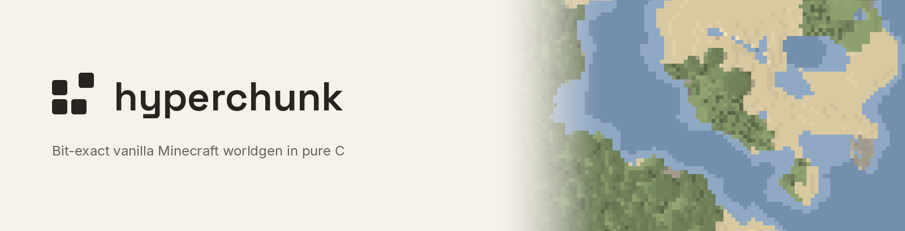
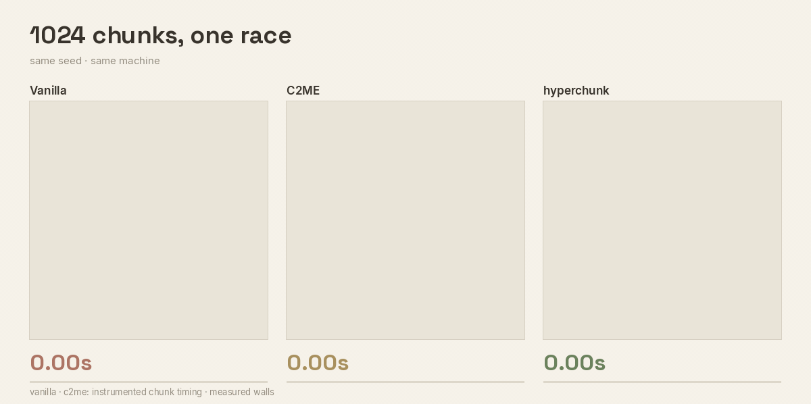

<picture>
  <source media="(prefers-color-scheme: dark)" srcset="assets/brand/banner-dark.png">
  
</picture>

**A bit-exact Minecraft-compatible world generator in pure C.**

hyperchunk reimplements the vanilla Java Edition overworld pipeline (noise,
surface rules, carvers, features, lighting) in C11, with nothing beyond libc
and no JVM in the generation path. Every byte of every chunk payload matches
vanilla. On the machine below, it generates 13.3x faster than the vanilla
server.

> NOT AN OFFICIAL MINECRAFT PRODUCT. NOT APPROVED BY OR ASSOCIATED WITH MOJANG
> OR MICROSOFT.

---

## Demo



All three panels replay measured per-chunk timing from the same machine:
hyperchunk from its own instrumentation, vanilla and C2ME from a Fabric mixin
mod that logs worldgen stage completions. Regenerates in about 10 seconds:

```bash
cd tools/viz && ./bin/hcviz render demo/race-b6.yaml --out demo/out/race-b6.gif
```

## Benchmarks

Region r.0.0 (1024 chunks, overworld, seed 1234567890) on one machine: OCI
`VM.Standard.E6.Flex`, 16 OCPU AMD EPYC 9J45 (Zen5), 32 vCPUs, Ubuntu 24.04,
OpenJDK 25.0.3. Medians of 3 runs, generation plus serialization:

| System | Wall | Chunks/s | vs vanilla |
|---|---|---|---|
| vanilla 26.2 dedicated server | 11.9 s | 86 | 1.00x |
| Fabric 0.19.3 + C2ME 0.4.2-alpha.0.35 | 3.7 s | 277 | 3.22x |
| hyperchunk REPLAY, 20 threads | 3.155 s | 325 | 3.77x |
| hyperchunk FREE, 20 threads | 0.894 s | 1145 | **13.3x** |

FREE and REPLAY run the same stage code under two scheduler policies
([ADR-008](openspec/specs/scheduler/context.md)). FREE picks its own conflict-free chunk order;
REPLAY reproduces the golden chunk order with canonical-identical output at
C2ME-class speed. The code proven bit-exact in REPLAY is the code timed in
FREE.

The multipliers are properties of this stage (AVX-512 dispatch, 32 vCPUs),
not a promise for arbitrary hardware. Conservative lower bounds after
subtracting the measurement-error budget: ≥12.5x vs vanilla, ≥3.3x vs C2ME.

Determinism is the other half of the result. Same seed, two runs: vanilla
differs in 581+/1024 chunks and C2ME in 758+/1024, because decoration order
is scheduler-dependent and gets baked into block content. hyperchunk differs
in 0, across all 12 runs at both 20 and 32 threads. ("Canonical-identical"
means sha256 over full chunk payloads with save-time fields normalized out;
raw `.mca` bit-equality is impossible for any implementation, including
vanilla itself, because the container embeds the capture-time wall clock.)

## Why

Vanilla evaluates density functions by walking an interpreter tree of
megamorphic virtual calls the JIT cannot inline: roughly 0.03-0.08
flops/cycle against an 8 flops/cycle ceiling. The workload is compute bound
(21.4 flops/byte of arithmetic intensity against a ridge point near 7.0), so
instruction-level wins translate directly into wall clock. The catch is that
bit-exact parity forbids FMA contraction, which doubles the dependency chains
needed to saturate the FP ports; register pressure, not vector width, is the
dominant constraint. Full analysis in
[ADR-004](openspec/specs/simd-backends/context.md).

## Architecture

```
┌─ libhyperchunk (pure C11, libc only, C ABI) ───────────────┐
│  arena allocator / SoA block storage                       │
│  flattened density function IR + compiler                  │
│    (AVX2 / AVX-512 backends, runtime dispatch)             │
│  full 26.2 chunk pipeline                                  │
│    (11 stages, structure_starts → full)                    │
│  dual-mode batch scheduler: FREE / REPLAY (ADR-008)        │
│  API: region-granularity batch entry points only  ← region │
└────────────────────────────────────────────────────────────┘
        ↑                ↑                  ↑
   hyperchunk CLI     FFM (Fabric)      Rust FFI (planned)
   bench + parity     Phase 3, planned  Pumpkin / Valence
```

Java allocates roughly 40,808 objects per chunk; arena and SoA storage take
that to zero, so batching gets cheaper as it grows
([ADR-003](openspec/specs/core-abi/context.md)).

## Design invariants

These are load-bearing. Violating any of them breaks the project.

| Invariant | Reason |
|---|---|
| Bit-exact parity with vanilla | The entire premise. Canonical payload `sha256` equality against golden captures is the acceptance test (ADR-007) |
| FMA prohibited everywhere | Contraction changes results. Enforced by `-ffp-contract=off` and an `objdump` gate script (`scripts/check_no_fma.sh`) |
| FFI boundary is per-region only | Per-node crossings cost 18.5% of chunk time. Node-level entry points are absent from the public header by design |
| Core is a pure compute library | No file I/O, no networking, no world state. Keeps the CLI, FFM, and Rust FFI consumers all viable |
| Unknown extensions fall back to vanilla | Correctness outranks speed. Fallback granularity is the whole chunk, never smaller |

## Status

Phase 1 (parity) and Phase 2 (performance) are complete; Phase 3, the Fabric
server bridge (Java FFM), has not started. The full region hashes identically
to the vanilla golden capture (sha256 pinned in
[golden/SHA256SUMS](golden/SHA256SUMS), asserted by `scripts/parity_gate.sh`);
37 tests, all green, sanitizer-clean. One qualifier
([ADR-007](openspec/specs/worldgen-parity/context.md)):
vanilla's own decoration order does not reproduce itself run to run, so the
byte-exact comparison replays the order recorded from the golden run.

Version pinned to 26.2, overworld only. Structures are placed but not
jigsaw-assembled. Nether, End, and the version matrix are out of scope for
now. [openspec/](openspec/project.md) holds the capability specs and the
nine architectural decision records (decision history in each capability's
`context.md`).

## Building

```bash
cmake -S . -B build && cmake --build build -j
ctest --test-dir build --output-on-failure
./scripts/check_no_fma.sh        # asserts no vfmadd/vfmsub in the artifact
./scripts/parity_gate.sh         # canonical payload hash vs golden/SHA256SUMS
```

Golden-gated tests read local-only vanilla captures under `golden/` (only
their sha256 pins are committed); regenerate them with the `tools/golden/`
harness on a fresh clone. Sanitizer and benchmark builds use the CMake
presets `asan-ubsan`, `tsan`, `release`, and `bench-o2`/`bench-o3`.

## Prior art

| Project | What it is | Gap |
|---|---|---|
| [Pumpkin](https://github.com/pumpkin-mc/pumpkin) | Full server in Rust | worldgen and saving incomplete |
| [Valence](https://github.com/valence-rs/valence) | Bevy ECS server framework | no vanilla worldgen |
| [Minestom](https://minestom.net/) | Java framework, no NMS | no vanilla worldgen, by design |
| [Cuberite](https://github.com/cuberite/cuberite) | C++ server | no vanilla parity |
| [C2ME](https://github.com/RelativityMC/C2ME-fabric) | Chunk gen optimization mod | bounded by the JVM |

[cubiomes](https://github.com/Cubitect/cubiomes) and the
[Minecraft Wiki](https://minecraft.wiki/w/Data_pack) made this tractable.

## Contributing

[.github/CONTRIBUTING.md](.github/CONTRIBUTING.md) covers setup, the commit
convention, and merge gates. Parity suites that need golden captures run
locally; CI covers the tracked-data subset. Security reports go through
[private advisories](.github/SECURITY.md).

## License

MIT. See [LICENSE](LICENSE).
